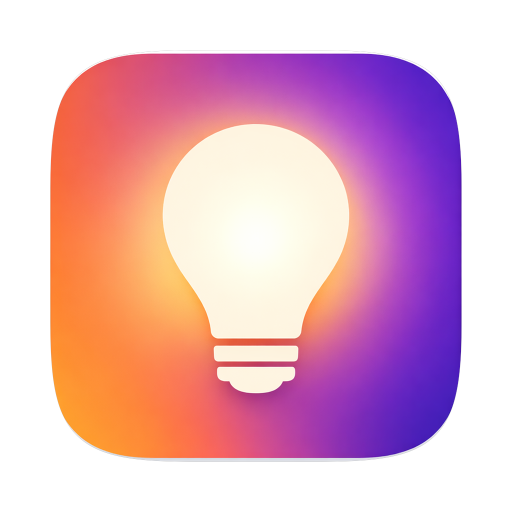
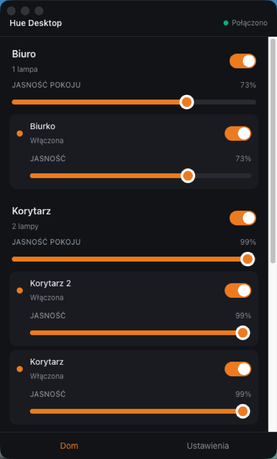

<div align="center">



# Hue Desktop

**Sterowanie oświetleniem Philips Hue z pulpitu — bez sięgania po telefon.**

Lekka aplikacja desktopowa na macOS, Windows i Linux, komunikująca się z Hue Bridge
bezpośrednio w sieci lokalnej. Bez backendu, bez konta, bez chmury.

</div>

---

<div align="center">

</div>

## Co potrafi

- **Znajduje Bridge** — mDNS, `discovery.meethue.com`, ostatni znany adres, albo ręcznie wpisane IP
- **Paruje się** przez fizyczny przycisk na Bridge i pamięta go między uruchomieniami
- **Steruje lampami** — włącz/wyłącz, jasność, temperatura barwowa, kolor RGB
- **Steruje pokojami** jednym żądaniem `grouped_light`, zamiast osobnej komendy do każdej lampy
- **Reaguje na zmiany z zewnątrz** — przełącznik ścienny, aplikacja Hue czy asystent głosowy
  natychmiast odświeżają widok dzięki strumieniowi zdarzeń Hue API v2
- **Wraca po zerwaniu połączenia** — wykładniczy backoff, a jeśli DHCP zmieni adres Bridge'a,
  aplikacja odnajduje go po identyfikatorze

Kontrolki są sterowane możliwościami sprzętu: zwykła żarówka White dostaje wyłącznie
włącznik, White Ambiance dodatkowo temperaturę, a kolorowa — pełny picker.

Interfejs jest w języku polskim.

## Widżet macOS

Aplikacja zawiera rozszerzenie WidgetKit — widżet z podglądem stanu oświetlenia,
dostępny w Centrum powiadomień i na pulpicie. Dwa rozmiary:

- **mały** — ile lamp świeci się z ilu wszystkich,
- **średni** — lista pokoi z jasnością każdego z nich.

Aby go dodać: kliknij prawym przyciskiem na pulpicie → *Edytuj widżety*, znajdź
**Hue Desktop** i przeciągnij wybrany rozmiar. Aplikacja musi być w `/Applications`.

Widżet jest **wyłącznie do odczytu i nie łączy się z Bridge'em**. Aplikacja zapisuje
mały zrzut stanu do wspólnego kontenera App Group, a widżet tylko go czyta — dzięki
temu klucz aplikacji Hue nie opuszcza magazynu chronionego Keychainem i nigdy nie
trafia do drugiego procesu.

**Odświeżanie:** widżet aktualizuje się cyklicznie, w praktyce w ciągu jednej–dwóch
minut od zmiany — nie natychmiast. `WidgetCenter.reloadAllTimelines()` jest przez
system ignorowane, gdy wywoła je proces pomocniczy zamiast samej aplikacji, więc
jedyną działającą ścieżką jest harmonogram timeline'u (a i ten WidgetKit dławi
własnym budżetem odświeżeń).

> Rozszerzenie działa wyłącznie w podpisanej, zainstalowanej paczce. W trybie
> deweloperskim (`npm start`) nie ma bundla aplikacji, więc system nie ma czego
> zarejestrować.

## Instalacja

Pobierz najnowszą wersję z [Releases](../../releases).

| System | Plik |
|---|---|
| macOS (Apple Silicon) | `Hue Desktop-<wersja>-arm64.dmg` |
| Windows | `Hue Desktop-<wersja> Setup.exe` |
| Linux | `.deb` / `.rpm` |

> **macOS:** wydania są podpisane certyfikatem Developer ID i notaryzowane przez Apple,
> więc otworzą się bez ostrzeżeń Gatekeepera.

> **Windows i Linux:** paczki są konfiguracyjnie gotowe, ale **nie zostały jeszcze
> zbudowane ani przetestowane** — patrz [Ograniczenia](#ograniczenia).

## Wymagania

- Philips Hue Bridge v2 (model BSB002) w tej samej sieci
- Firmware ze wsparciem Hue API v2 (`/clip/v2`)
- Fizyczny dostęp do Bridge'a przy pierwszym parowaniu — Hue wymaga naciśnięcia przycisku

## Rozwój

```bash
npm install
npm start          # uruchamia aplikację w trybie deweloperskim
npm test           # testy jednostkowe i integracyjne (Vitest)
npm run typecheck  # TypeScript, tryb strict
npm run lint
npm run make       # buduje instalatory do out/make
```

Test na prawdziwym sprzęcie (domyślnie pomijany) — wykonuje pełny handshake TLS
z Bridge'em pod wskazanym adresem:

```bash
HUE_BRIDGE_IP=192.168.1.42 npm test
```

Podpisany i notaryzowany build macOS, razem z widżetem:

```bash
HUE_SIGN=1 \
APPLE_API_KEY_PATH=~/private_keys/AuthKey_XXXXXXXX.p8 \
APPLE_API_KEY_ID=XXXXXXXX \
APPLE_API_ISSUER=<issuer-uuid> \
npm run make
```

Rozszerzenie widżetu jest budowane samym `swiftc` i składane ręcznie w `.appex`
(`widget/build-widget.sh`) — nie ma projektu Xcode, bo to jeden plik Swifta, a
`.appex` to zwykły bundle z `Info.plist` i binarką. Cały build jest odtwarzalny
z linii poleceń. Przy forku podmień `HUE_TEAM_ID` oraz identyfikator App Group
w `widget/HueWidget.swift` i `src/main/widget/WidgetBridge.ts`.

## Architektura

Granica systemu przebiega tak, że renderer nigdy nie dotyka sieci ani poświadczeń:

```
React (Zustand + TanStack Query)
      │  window.hue — wyłącznie model domenowy
      ▼
Electron preload (contextBridge)
      │  typowane IPC, walidacja Zod po stronie main
      ▼
Electron main
      │  HueApi · HueClient · HueTransport · HueEventStream
      │  BridgeDiscovery · BridgePairing · ConnectionManager · SecureStorage
      ▼  HTTPS (lokalnie)
Philips Hue Bridge  →  Zigbee  →  💡
```

Renderer nie wie, czym jest HTTPS, mDNS, CIE xy ani `hue-application-key`. Zna wyłącznie
`Light`, `Room` i `Bridge`. Dzięki temu zmiana wersji Hue API nie dotyka warstwy UI.

### Bezpieczeństwo

- `nodeIntegration: false`, `contextIsolation: true`, `sandbox: true` — renderer nie ma
  dostępu do żadnego API Node'a
- Klucz aplikacji jest szyfrowany przez `safeStorage` (Keychain / DPAPI / secret service)
  i nigdy nie trafia do renderera
- **TLS jest weryfikowany, nie wyłączany.** Bridge przedstawia certyfikat wystawiony przez
  prywatne CA Signify (`CN=root-bridge`), którego nie ma w zaufanych magazynach systemowych
  i który nie zawiera pola `subjectAltName`. Aplikacja dołącza to CA, ufa **wyłącznie**
  jemu, a domyślne sprawdzenie nazwy hosta zastępuje jawnym porównaniem Common Name
  z identyfikatorem Bridge'a. Nigdzie w kodzie nie ma `rejectUnauthorized: false`.
- Content Security Policy jest nakładana na build produkcyjny

## Ograniczenia

- **Zweryfikowano wyłącznie na macOS.** Konfiguracja dla Windows i Linuksa istnieje,
  ale te paczki nie były budowane ani uruchamiane.
- **mDNS nie przechodzi między podsieciami**, przez VPN ani przez część access pointów.
  Gdy Bridge jest w innej podsieci niż komputer, zadziała discovery przez chmurę
  albo ręczne wpisanie adresu IP.
- **Linux bez systemowego magazynu haseł**: gdy `safeStorage` zgłasza backend `basic_text`,
  aplikacja wyświetla ostrzeżenie, że klucz nie jest realnie chroniony.
- Sceny, tray, globalne skróty i automatyzacje nie wchodzą w skład tej wersji.
- Widżet macOS wymaga systemu **macOS 14 lub nowszego** i jest dostępny wyłącznie
  na macOS.

## Roadmapa

| Wersja | Zakres |
|---|---|
| **MVP** *(obecnie)* | Bridge, lampy, pokoje, jasność, temperatura, kolor, stan połączenia |
| v1 | Sceny, menu bar / tray, ulubione, skróty klawiszowe, start z systemem |
| v1.5 | Wiele Bridge'y, szybkie akcje, automatyzacje |
| v2 | Hue Remote API, sterowanie spoza sieci domowej |

## Licencja

[MIT](LICENSE)

---

<div align="center">
<sub>Niezwiązane z Signify ani Philips Hue. „Philips" i „Hue" są znakami towarowymi Signify Holding.</sub>
</div>
